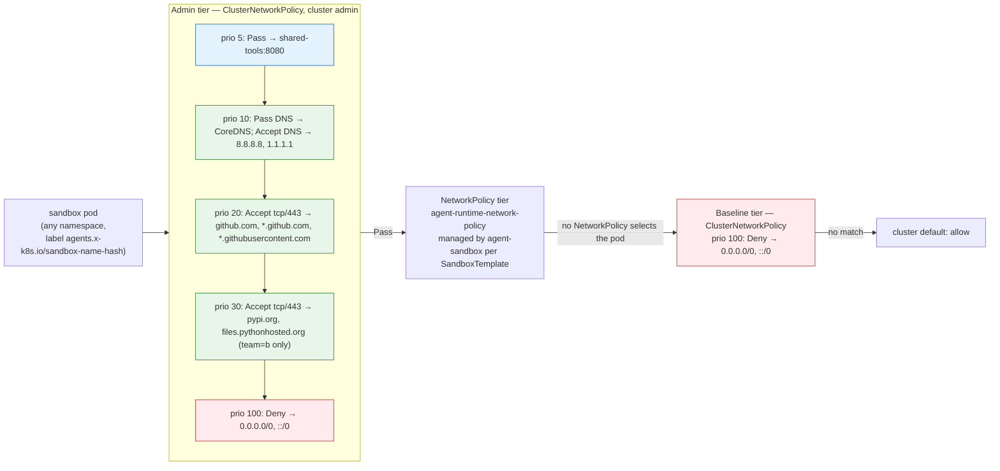

# Cluster-wide egress control for sandboxes with the Network Policy API

This example shows how to combine three layers of Kubernetes network policy
around agent-sandbox, on a local kind cluster:

1. the **Kubernetes `NetworkPolicy`** the agent-sandbox controller already
   manages for every `SandboxTemplate` (the namespace owner's layer);
2. **`ClusterNetworkPolicy`** from the SIG Network
   [Network Policy API](https://network-policy-api.sigs.k8s.io/): cluster
   admin guardrails with tiers, priorities, `Deny`, `Pass`, and **egress by
   domain name** (`github.com`, `*.github.com`);
3. **[kube-network-policies](https://kube-network-policies.sigs.k8s.io/)**,
   the SIG Network reference implementation that enforces both.

The end result is what most sandbox operators ask for: all egress from every
sandbox is denied by default, specific destinations are allowed by FQDN with
higher-precedence policies, and the per-template `NetworkPolicy` that
agent-sandbox already creates keeps working.

## Why this example exists

agent-sandbox's built-in networking is a per-template Kubernetes
`NetworkPolicy` ([details](https://github.com/kubernetes-sigs/agent-sandbox/blob/main/examples/policy/network-policy-management/README.md)).
Its Secure-by-Default posture blocks the cluster network, the metadata server
and CoreDNS, and allows the public internet. That is a reasonable default, but
Kubernetes `NetworkPolicy` has two limitations that matter for sandboxes:

- It cannot express "only github.com". Peers are IP blocks and label
  selectors, so there is no way to say that an agent may reach GitHub and PyPI
  but nothing else.
- It is not a guardrail. `NetworkPolicy` is namespace-scoped and can only add
  allows. Anyone who can edit a `SandboxTemplate` can set
  `networkPolicyManagement: Unmanaged` or write a permissive `networkPolicy`,
  and there is no cluster-level policy that takes precedence.

`ClusterNetworkPolicy` is an official Kubernetes API and fixes both.

### Why the templates stay `Managed`

The [network policy management guide](https://github.com/kubernetes-sigs/agent-sandbox/blob/main/examples/policy/network-policy-management/README.md#troubleshooting)
suggests `networkPolicyManagement: Unmanaged` when you need FQDN or L7 rules,
because vendor policy CRDs usually replace Kubernetes `NetworkPolicy` rather
than work with it. This example keeps the templates `Managed` instead:

- The Network Policy API is designed to work with `NetworkPolicy`, not to
  replace it. The NetworkPolicy tier sits between the Admin and Baseline tiers,
  and the `Pass` action exists to delegate a decision to it. With `Unmanaged`
  there is no `NetworkPolicy` to delegate to, so the cluster admin has to
  encode every tenant's needs in Admin-tier policies.
- The controller keeps managing one `NetworkPolicy` per template: the secure
  default (ingress only from the sandbox-router, the RFC1918 and metadata
  carve-outs, the DNS override) for templates without custom rules, or the
  template's own `networkPolicy` rules otherwise. The `ClusterNetworkPolicy`
  objects are added on top, and `Pass` hands decisions back to that policy.
- Everything is upstream Kubernetes API. `NetworkPolicy`,
  `ClusterNetworkPolicy` and the labels the controller puts on pods behave the
  same on any cluster and with any conformant implementation.

`Unmanaged` is still the option when a feature only exists in the CNI's own
policy object. However, for cluster-wide
defaults and FQDN egress the upstream API is enough.

## How the tiers fit together



Evaluation order is **Admin → NetworkPolicy → Baseline → cluster default**.
Within a tier, **lower `priority` wins** (0 is highest precedence, 1000
lowest); within a policy, rules are evaluated top to bottom. An `Accept` or
`Deny` is final; `Pass` hands the decision to the next tier; a policy that does
not match behaves like `Pass`.

## About the implementation

[kube-network-policies](https://github.com/kubernetes-sigs/kube-network-policies)
is the Kubernetes SIG Network **reference implementation** of `NetworkPolicy`
and of the Network Policy API `ClusterNetworkPolicy`. It runs as a DaemonSet and:

- It is additive and does not depend on the CNI. It adds a second policy
  engine in the packet path, so a connection has to be allowed by both the CNI
  and kube-network-policies. This makes it usable on any cluster whose network
  plugin does not implement these APIs, including the kind cluster used here:
  kindnet, kind's default CNI, implements standard `NetworkPolicy` by embedding
  this same library, and the DaemonSet installed in step 2 adds
  `ClusterNetworkPolicy` on top.
- Any implementation that supports the experimental `domainNames` extension can
  be used instead. Only the install step is specific to kube-network-policies;
  if your CNI implements `ClusterNetworkPolicy` (see the
  [implementations list](https://network-policy-api.sigs.k8s.io/implementations/))
  and this extension, skip step 2 and apply the same manifests. An implementation
  supporting only the standard channel must replace or omit the FQDN manifests.

For domain names, kube-network-policies observes the DNS answers delivered to
pods on each node and keeps a per-node domain→IP cache (TTL clamped to
30s–300s). A `domainNames` rule matches a destination IP if an allowed name
resolved to it recently. This works with any resolver (CoreDNS or the public
resolvers agent-sandbox injects), but DNS traffic has to be allowed before any
FQDN rule can match, which is why the walkthrough allows DNS in a separate
step.

## Prerequisites

- Docker, [kind](https://kind.sigs.k8s.io/) (v0.27+), `kubectl`, `curl`.
- Outbound internet from the kind nodes (the sandboxes hit github.com and
  pypi.org; images are pulled from registry.k8s.io and Docker Hub).

Versions are pinned in [env.sh](https://github.com/kubernetes-sigs/agent-sandbox/blob/main/examples/network-policy-api-sandbox/env.sh):

| Component | Version | Notes |
|---|---|---|
| network-policy-api | `v0.2.0` | `ClusterNetworkPolicy` CRD, **experimental channel** (`domainNames` is not in the standard channel yet) |
| kube-network-policies | `v1.1.1` | `install-cnp.yaml` + image `…:v1.1.1-npa-v1alpha2`, with `--fail-open=false` added (see [notes](#notes-and-gotchas)) |
| agent-sandbox | `v1.0.2` | core + extensions (`sandbox-with-extensions.yaml`); `AGENT_SANDBOX_VERSION=latest` picks the newest release |

## Quick start

```bash
cd examples/network-policy-api-sandbox

./scripts/setup-all.sh   # kind cluster → CNP CRD + kube-network-policies → agent-sandbox → demo workloads
./scripts/test.sh        # applies the policies phase by phase and asserts 23 allow/deny outcomes
```

`test.sh` finishes in about three minutes and is re-runnable. The rest of this
document walks the same phases by hand.

| Script | Purpose |
|---|---|
| `scripts/01-create-cluster.sh` | kind cluster, 1 control-plane + 1 worker, default CNI. |
| `scripts/02-install-network-policies.sh` | `ClusterNetworkPolicy` CRD (experimental channel) + kube-network-policies CNP DaemonSet, pinned, fail-closed. |
| `scripts/03-install-agent-sandbox.sh` | agent-sandbox core + extensions from the pinned GitHub release. |
| `scripts/04-deploy-demo.sh` | Namespaces, tool server, one `SandboxTemplate` + `SandboxWarmPool` + `SandboxClaim` per tenant. **No CNP yet.** |
| `scripts/test.sh` | Phase-by-phase assertions; non-zero exit on any failure. |
| `scripts/teardown.sh` | Removes the demo resources; `--all` deletes the kind cluster. |

| Manifest | Tier / prio | What it does |
|---|---|---|
| `manifests/00-namespaces.yaml` | — | `sandbox-team-a` (`team=a`), `sandbox-team-b` (`team=b`), `shared-tools`. |
| `manifests/10-shared-tools.yaml` | — | An in-cluster HTTP "tool server" (agnhost `netexec` on :8080). |
| `manifests/20-sandbox-templates.yaml` | NetworkPolicy | Two Managed templates: team-a uses the secure default; team-b adds egress to `shared-tools`. |
| `manifests/30-cnp-admin-default-deny.yaml` | Admin / 100 | Deny all egress from every sandbox pod. |
| `manifests/40-cnp-admin-allow-dns.yaml` | Admin / 10 | `Pass` UDP+TCP 53 to CoreDNS → the template's NetworkPolicy decides; Accept UDP+TCP 53 to `8.8.8.8`, `1.1.1.1`. |
| `manifests/50-cnp-admin-allow-github.yaml` | Admin / 20 | Accept tcp/443 to `github.com`, `*.github.com`, `*.githubusercontent.com`. |
| `manifests/60-cnp-admin-team-b-allow-pypi.yaml` | Admin / 30 | Accept tcp/443 to `pypi.org`, `files.pythonhosted.org` — `team=b` namespaces only. |
| `manifests/70-cnp-admin-pass-shared-tools.yaml` | Admin / 5 | `Pass` tcp/8080 to `shared-tools` → the template's NetworkPolicy decides. |
| `manifests/80-cnp-baseline-default-deny.yaml` | Baseline / 100 | Deny egress for sandbox pods no NetworkPolicy selects. |
| `manifests/90-raw-sandbox.yaml` | — | A `Sandbox` without a template, to exercise the Baseline tier. |

## Walkthrough

Run the setup first (`./scripts/setup-all.sh`), then define a few helpers. The
sandbox image is `python:3.12-slim`, so the probes are one-liners in Python;
denied traffic is *dropped*, not rejected, so the 5-second timeout is what
turns a deny into `fail`.

```bash
source env.sh
A=$(kubectl get sandboxclaim agent -n sandbox-team-a -o jsonpath='{.status.sandbox.name}')
B=$(kubectl get sandboxclaim agent -n sandbox-team-b -o jsonpath='{.status.sandbox.name}')
TOOLS=http://$(kubectl get svc tool-server -n shared-tools -o jsonpath='{.spec.clusterIP}'):8080/hostname

http() { kubectl exec -n "$1" "$2" -- python3 -c 'import sys,urllib.request,urllib.error
try: urllib.request.urlopen(sys.argv[1], timeout=5).read(1); print("ok")
except urllib.error.HTTPError: print("ok")   # reached it; the HTTP status is not the point
except Exception: print("fail")' "$3"; }
dns()  { kubectl exec -n "$1" "$2" -- python3 -c 'import sys,socket
try: socket.getaddrinfo(sys.argv[1], 443); print("ok")
except Exception: print("fail")' "$3"; }
```

### Phase 1 — what the template-managed NetworkPolicy gives you

`04-deploy-demo.sh` created one `SandboxTemplate` per tenant with
`networkPolicyManagement: Managed`. The controller created a `NetworkPolicy`
for each:

```console
$ kubectl get networkpolicy -A
NAMESPACE        NAME                           POD-SELECTOR                                         AGE
sandbox-team-a   agent-runtime-network-policy   agents.x-k8s.io/sandbox-template-ref-hash=5f52e237   8s
sandbox-team-b   agent-runtime-network-policy   agents.x-k8s.io/sandbox-template-ref-hash=5f52e237   8s
```

team-a has no `networkPolicy` block, so it gets the Secure-by-Default posture
(public internet only; pod DNS pointed at `8.8.8.8`/`1.1.1.1`). team-b defines
custom rules that keep the same defaults and add egress to `shared-tools`
(custom rules also disable the DNS override, so team-b resolves through
CoreDNS).

```bash
http sandbox-team-a "$A" https://github.com     # ok
http sandbox-team-a "$A" https://example.com    # ok   <- any public site; NetworkPolicy cannot say "only github"
http sandbox-team-a "$A" "$TOOLS"               # fail <- RFC1918 carve-out in the secure default
http sandbox-team-b "$B" "$TOOLS"               # ok   <- team-b's template allows shared-tools
```

All the cluster-wide policies below select pods by the controller's tracking
label, so no namespace labelling is needed:

```console
$ kubectl get pods -A -l agents.x-k8s.io/sandbox-name-hash
NAMESPACE        NAME               READY   STATUS    RESTARTS   AGE
sandbox-team-a   agent              1/1     Running   0          6s
sandbox-team-a   agent-pool-qtr6m   1/1     Running   0          8s
sandbox-team-b   agent              1/1     Running   0          6s
sandbox-team-b   agent-pool-gsn5l   1/1     Running   0          8s
```

The label binds the code running *inside* the sandbox, which has no API
credentials; it does not bind namespace principals, since anyone with `update`
on pods could strip it. Guarding against that is an admission-control problem,
not a network-policy one.

### Phase 2 — Admin-tier default deny

```bash
kubectl apply -f manifests/30-cnp-admin-default-deny.yaml
```

```yaml
spec:
  tier: Admin
  priority: 100          # lowest precedence of the Admin policies here: a catch-all
  subject:
    pods:
      namespaceSelector: {}
      podSelector:
        matchExpressions:
          - key: agents.x-k8s.io/sandbox-name-hash
            operator: Exists
  egress:
    - name: deny-everything-else
      action: Deny
      to:
        - networks: ["0.0.0.0/0", "::/0"]
```

All egress from every sandbox is now denied, including DNS and including
team-b's access to `shared-tools` even though its `NetworkPolicy` allows it:

```bash
dns  sandbox-team-a "$A" github.com    # fail
http sandbox-team-a "$A" https://github.com   # fail
http sandbox-team-b "$B" "$TOOLS"      # fail <- Admin tier beats NetworkPolicy
```

The policy has no `ingress` rules, so the sandbox-router's path into the pod
is unaffected and still governed by the template's `NetworkPolicy`.

### Phase 3 — open DNS, and only DNS

```bash
kubectl apply -f manifests/40-cnp-admin-allow-dns.yaml
```

Priority 10 is evaluated before 100. The policy Accepts UDP/TCP 53 to the two
public resolvers agent-sandbox injects, and nothing else: an unrestricted
port-53 rule would let a sandbox talk to any DNS server directly. Query names
are not inspected, so data can still be tunnelled through the allowed recursive
resolvers; closing that needs a DNS proxy with a query-name policy, which is out
of scope here.

CoreDNS is a `Pass`, not an `Accept`. An Admin-tier `Accept` is final, and
team-a's secure default deliberately blocks the cluster resolver so internal
service names cannot be enumerated; an `Accept` here would silently reopen it
for every sandbox. `Pass` hands the decision back to each template's
`NetworkPolicy`: team-b's allows kube-dns, team-a's does not.

```bash
dns  sandbox-team-a "$A" github.com          # ok   (via 8.8.8.8)
dns  sandbox-team-b "$B" github.com          # ok   (via CoreDNS: Pass → team-b's NetworkPolicy allows it)
kubectl exec -n sandbox-team-a "$A" -- python3 -c \
  'import socket; socket.create_connection(("10.96.0.10", 53), timeout=5)'   # times out: Pass → secure default blocks RFC1918
http sandbox-team-a "$A" https://github.com  # fail (resolves, but tcp/443 is still denied)
```

### Phase 4 — allow GitHub by name

```bash
kubectl apply -f manifests/50-cnp-admin-allow-github.yaml
```

```yaml
  egress:
    - name: github-https
      action: Accept
      to:
        - domainNames:
            - github.com
            - "*.github.com"             # api., codeload., ...; does not match github.com itself
            - "*.githubusercontent.com"  # raw files and release assets
      protocols:
        - tcp: { destinationPort: { number: 443 } }
```

```bash
http sandbox-team-a "$A" https://github.com      # ok
http sandbox-team-a "$A" https://api.github.com  # ok   <- wildcard
http sandbox-team-a "$A" https://example.com     # fail <- still caught by the prio-100 deny
```

Two things to note:

- `domainNames` can only be used in Accept rules. A Deny keyed on domain names
  would fail open whenever the implementation has not seen the relevant DNS
  answer, so the pattern is to accept by name at higher precedence and deny by
  CIDR at lower precedence, as phases 2 and 4 do.
- Matching is done on IPs learned from DNS answers. Connecting to an IP that no
  allowed name resolved to is denied, even on port 443:

  ```bash
  kubectl exec -n sandbox-team-a "$A" -- python3 -c \
    'import socket; socket.create_connection(("1.1.1.1", 443), timeout=5)'   # times out
  ```

### Phase 5 — per-tenant allowlists

```bash
kubectl apply -f manifests/60-cnp-admin-team-b-allow-pypi.yaml
```

Same policy shape with a narrower subject:
`namespaceSelector: {matchLabels: {team: b}}`. The pod selector is kept so the
policy does not cover non-sandbox pods in the namespace. Labels are not
authentication: whoever can create or label namespaces can opt into this
allowlist, so `team` has to be a label only cluster admins set. `pip` needs
both the index and the file host:

```bash
kubectl exec -n sandbox-team-b "$B" -- pip download --no-deps -q -d /tmp/pkgs requests && echo ok   # ok
kubectl exec -n sandbox-team-a "$A" -- pip download --no-deps -q -d /tmp/pkgs --timeout 5 --retries 0 requests || echo fail  # fail
```

### Phase 6 — compose with the NetworkPolicy tier using `Pass`

So far the Admin tier has made every decision. `Pass` delegates a decision to
the next tier, in this case the `NetworkPolicy` the agent-sandbox controller
manages for each template:

```bash
kubectl apply -f manifests/70-cnp-admin-pass-shared-tools.yaml
```

```yaml
spec:
  tier: Admin
  priority: 5            # must precede the prio-100 deny
  egress:
    - name: let-the-namespace-networkpolicy-decide
      action: Pass
      to:
        - namespaces:
            matchLabels:
              kubernetes.io/metadata.name: shared-tools
      protocols:
        - tcp: { destinationPort: { number: 8080 } }
```

```bash
http sandbox-team-b "$B" "$TOOLS"   # ok   <- Pass → team-b's NetworkPolicy lists shared-tools
http sandbox-team-a "$A" "$TOOLS"   # fail <- Pass → team-a's secure default blocks RFC1918
```

The cluster admin allows tenants to opt in to `shared-tools`; each
`SandboxTemplate` opts in (or not) through `spec.networkPolicy.egress`.

### Phase 7 — Baseline tier for sandboxes without a NetworkPolicy

A plain `Sandbox` created without a template is not selected by any
`NetworkPolicy`:

```bash
kubectl apply -f manifests/90-raw-sandbox.yaml
kubectl wait --for=condition=Ready sandbox/raw-sandbox -n sandbox-team-a --timeout=180s
http sandbox-team-a raw-sandbox "$TOOLS"   # ok  <- Pass → no NetworkPolicy → Baseline empty → cluster default: allow
```

The `Pass` went through the NetworkPolicy tier with no match and ended at the
Kubernetes default, which is allow. An Admin-tier `Deny` would close this but
would also break team-b. A Baseline-tier policy only applies when no
`NetworkPolicy` selected the pod:

```bash
kubectl apply -f manifests/80-cnp-baseline-default-deny.yaml
http sandbox-team-a raw-sandbox "$TOOLS"   # fail
http sandbox-team-b "$B" "$TOOLS"          # ok  <- team-b's NetworkPolicy still wins over Baseline
```

Final state:

```console
$ kubectl get clusternetworkpolicy
NAME                               TIER       PRIORITY   AGE
sandbox-egress-allow-dns           Admin      10         2m35s
sandbox-egress-allow-github        Admin      20         2m26s
sandbox-egress-baseline-deny       Baseline   100        66s
sandbox-egress-default-deny        Admin      100        3m24s
sandbox-egress-pass-shared-tools   Admin      5          79s
sandbox-egress-team-b-allow-pypi   Admin      30         2m7s
```

## Seeing the verdicts

kube-network-policies logs every evaluated packet at `-v=2` and above
(`install-cnp.yaml` runs at `-v=4`). Trigger a denied connection, then read
the DaemonSet pod on the sandbox's node:

```bash
http sandbox-team-a "$A" https://example.com   # fail
NODE=$(kubectl get pod "$A" -n sandbox-team-a -o jsonpath='{.spec.nodeName}')
KNP=$(kubectl get pods -n kube-system -l app=kube-network-policies --field-selector spec.nodeName="$NODE" -o name)
kubectl logs -n kube-system "$KNP" --since=1m | grep -B3 -A2 'tier="Admin" npolicies=[0-9]* action="Deny"'
```

```text
"Evaluating packet" id=303 direction="Egress" srcPod="sandbox-team-a/agent" dstPod="external" packet=<
        [303] 10.244.1.6:37368 172.66.147.243:443 TCP
 >
"Egress CNP evaluation" id=303 tier="Admin" npolicies=4 action="Deny"
"Packet denied by egress policy" id=303
"Finished syncing packet" id=303 duration="171.516µs" verdict="drop"
```

`npolicies=4` is the number of Admin-tier policies whose subject matched the
pod; the verdict came from the first rule that matched in priority order. Add
`--logging-format=json` to the DaemonSet args to get the same entries as JSON
for `jq` (see the
[JSON logging guide](https://kube-network-policies.sigs.k8s.io/docs/user/json-logging/)).

## Notes and gotchas

- `domainNames` is marked `<network-policy-api:experimental>`. The
  standard-channel CRD does not have the field, so `kubectl apply` of
  `50-`/`60-` fails schema validation with it. Graduation is tracked in the
  [FQDN NPEP](https://network-policy-api.sigs.k8s.io/npeps/npep-133-fqdn-egress-selector/).
- The install script adds `--fail-open=false` to the kube-network-policies
  DaemonSet. The upstream default is fail-open: the nfqueue rule carries the
  `bypass` flag, so while the agent is down or restarting packets are accepted
  unevaluated and a default-deny guardrail silently disappears. Fail-closed
  drops new pod connections during that window instead (node traffic from root,
  such as kubelet and image pulls, is not queued). Pick the side of that
  trade-off deliberately before reusing the manifest on a real cluster.
- DNS is part of the allowlist. The FQDN cache is fed by the DNS answers the
  pod actually received; if a sandbox resolves through a path that is not
  allowed (a hard-coded resolver, DoH), its names never enter the cache and the
  connection is denied. This is the intended fail-closed behaviour. The DNS
  capture queue itself is always fail-open (`queue flags bypass`, independent
  of `--fail-open`), so under heavy load
  an answer can slip past the agent; the connection that follows is denied and
  works once the name is resolved again. `test.sh` retries the "allowed"
  checks for this reason.
- Learned IPs expire after the answer's TTL, clamped to 30s–300s. Established
  connections are not affected (only new connections are evaluated), but an
  agent that caches an IP for minutes and reconnects may be denied until it
  resolves the name again.
- If two policies in one tier share a priority and both match, the API leaves
  the winner undefined. Keep priorities unique for policies with overlapping
  subjects, as this example does.
- With `ClusterNetworkPolicy` in use, kube-network-policies evaluates the first
  packet of every new connection on the node in userspace. This is fine for a
  kind cluster and for typical agent workloads; measure before using it on a
  high-throughput path, or use a CNI with native support and the same
  manifests.
- Image pulls happen from the node, outside the pod's egress policy, which is
  why `python:3.12-slim` can still be pulled under default-deny.
- All policies in this example are egress-only. The
  sandbox-router path documented in
  [network-policy-management](https://github.com/kubernetes-sigs/agent-sandbox/blob/main/examples/policy/network-policy-management/README.md)
  keeps working; add `ingress` rules to the Admin policies if you want a
  cluster-wide ingress floor too.

## Teardown

```bash
./scripts/teardown.sh        # remove the demo resources, keep the cluster
./scripts/teardown.sh --all  # delete the kind cluster
```
