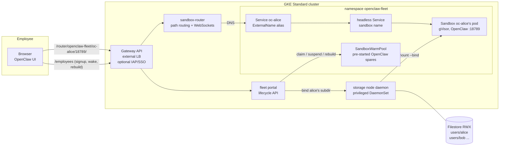
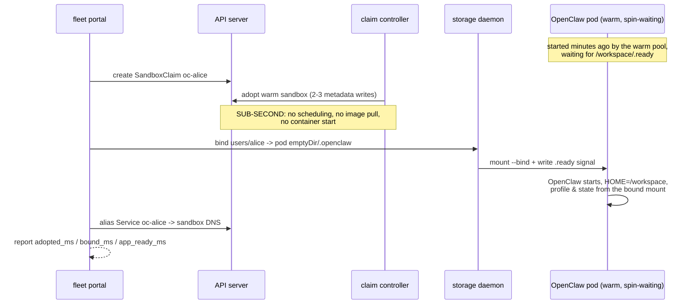
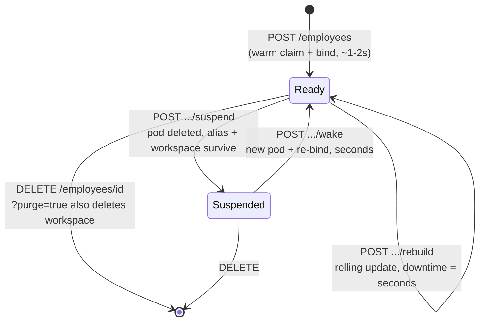

# OpenClaw Fleet on GKE: sub-second claims, per-employee workspaces, full lifecycle

## Customer requirements

This example exists to serve a concrete customer shape: an enterprise
preparing to deploy **~9,000 per-employee [OpenClaw](https://openclaw.ai)
sandboxes on GKE**, anchored on four architectural pillars — (a) sandbox
identity and storage isolation keyed by employee ID, (b) warm-pool
management that keeps cold-start latency inside tight targets, (c)
end-to-end lifecycle orchestration (provision, image/config rollout,
suspend/resume), and (d) scalability with **20 GB of NAS-backed storage per
employee** and dynamic storage allocation. The customer's PoC test
checklist defines the P0 bar, and **everything deployed by this example
meets every P0 row** — options that trade away a P0 (e.g. hard storage
isolation at the cost of warm claims, or Autopilot at the cost of the
storage daemon) appear only in the [appendix](#appendix-alternatives),
never in the main path.

| P0 | Requirement (from the PoC checklist) | Mechanism in this example | Verified by |
|---|---|---|---|
| 1 | Startup: warm-pool claims (record expected vs. actual), image-cache-accelerated batch creation | `SandboxWarmPool` + warm `SandboxClaim` adoption; image streaming + optional secondary boot disk | `run-test-gke.sh` §1, [`tools/measure-claim-latency.sh`](tools/measure-claim-latency.sh) |
| 2 | Deletion succeeds; all resources released | claim delete cascades sandbox/pod/Service; portal purges alias + workspace | `run-test-gke.sh` §2 |
| 3 | Sleep releases resources; wake-up duration recorded | `Sandbox.spec.operatingMode` (disk-tier) and GKE Pod Snapshots (memory-tier) | `run-test-gke.sh` §3, [`60-snapshots/`](60-snapshots/) |
| 4 | Image updates for sandboxes AND the warm pool, auto-restart post-update; CPU/memory scale-up plan | template bump → `Recreate` pool refresh → rate-limited per-employee rebuilds (same path resizes CPU/memory) | `run-test-gke.sh` §4, [`70-rolling-update.sh`](70-rolling-update.sh) |
| 5 | Storage: high-speed NAS ONLY (block SSD too expensive); NAS attach limits need a solution for 9,000 users × 20 GB | ONE shared Filestore **zonal (high-speed SSD NAS)** volume, per-employee subdirectories **late-bound** into running warm pods — 1 PV per ~5,000 users | `run-test-gke.sh` §5 |
| 6 | Distinct, persistent access address per sandbox (e.g. employee ID) | per-sandbox headless Service + `oc-<employee>` alias + Gateway API + [sandbox-router](../../sandbox-router/) path routing | `run-test-gke.sh` §6 |
| 10 | I/O performance testing on the NAS tier *(customer test team)* | ready-to-run fio harness against the deployed workspace volume | [`tools/fio-workspace-job.yaml`](tools/fio-workspace-job.yaml) |
| 11 | Multi-agent, Feishu/Lark integration, business validation *(customer test team)* | stock OpenClaw with persistent per-employee config; NetworkPolicy egress allows DNS + 443 (provider APIs, Feishu/Lark HTTPS/WSS); inbound webhooks ride the stable per-employee URL | template NetworkPolicy in [`20-openclaw-template.yaml`](20-openclaw-template.yaml) |
| F1 | *(follow-up P0)* Per-employee config injection — profiles, settings, keys — without losing warm claims | portal **seeds files pre-claim** via a pod-independent daemon `seed` action (create-if-absent); entrypoint merges `openclaw.overrides.json` over the fleet base pre-launch; claim-time labels + downwardAPI carry small runtime values | `run-test-gke.sh` §7 |
| F2 | *(follow-up P0)* Dynamic storage resizing to eliminate excess capacity overhead | **online in-band growth**: patch the shared PVC in 256 GiB steps, already-running sandboxes see the new capacity with no restart; shrink and per-user quotas: see [Known gaps](#known-gaps) | `run-test-gke.sh` §8 |

P1 rows (daily cost per runtime profile, DR backup/restore, security
testing) are addressed directionally in [Cost dials](#cost-dials),
[`60-snapshots/`](60-snapshots/) (workspace + snapshot restore paths), and
[SSO / IdP integration](#sso--idp-integration); the honest deltas live in
[Known gaps](#known-gaps).

The central design rule, from which everything else follows: **a warm claim
is only sub-second because it changes nothing about the running pod except
metadata.** Per-claim env vars or volumes force a cold start, so *everything
per-employee arrives at claim time without touching the pod spec* — the
employee's Filestore subdirectory is bind-mounted into the already-running
pod by a node daemon, and OpenClaw loads its profile, settings and assets
from that mount. One unified `SandboxTemplate` therefore serves every
employee.

## Architecture



How a claim stays sub-second — the pod is already running before the
employee exists:



The employee lifecycle (every transition is a portal endpoint and a
checklist item):



## Files

| File | Role |
|---|---|
| [`setup/provision-gke.sh`](setup/provision-gke.sh) | GKE Standard cluster: gVisor node pool, image streaming, Filestore CSI, Gateway API, snapshot bucket, controller install. [`setup/teardown-gke.sh`](setup/teardown-gke.sh) removes everything. |
| [`00-prereqs.yaml`](00-prereqs.yaml) | Namespace, fleet-shared OpenClaw base config, secret shapes (daemon token, provider keys). |
| [`10-storage.yaml`](10-storage.yaml) | Shared Filestore RWX PVC + privileged **storage node daemon** that late-binds `users/<employee>` into warm pods (token-authenticated, NetworkPolicy-scoped). |
| [`20-openclaw-template.yaml`](20-openclaw-template.yaml) | The unified `SandboxTemplate`: gVisor, real OpenClaw image, spin-wait entrypoint, injection policies `Disallowed`, per-sandbox Service, managed fleet NetworkPolicy. |
| [`30-warmpool.yaml`](30-warmpool.yaml) | `SandboxWarmPool` (`updateStrategy: Recreate`) + sizing notes for large fleets. |
| [`40-fleet-portal/`](40-fleet-portal/) | The lifecycle control plane (~300 lines of Python, pattern from [hermes-agents-as-a-service](../hermes-agents-as-a-service/)): signup/suspend/wake/rebuild/delete with per-phase timings. |
| [`50-router/`](50-router/) | Go [sandbox-router](../../sandbox-router/) + GKE Gateway + HTTPRoutes + optional IAP policy: the stable per-employee URL. |
| [`60-snapshots/`](60-snapshots/) | Memory-tier sleep/wake: GKE Pod Snapshots manifests + runbooks for both sleep tiers. |
| [`70-rolling-update.sh`](70-rolling-update.sh) | Rate-limited fleet-wide rebuild after a template change. |
| [`tools/`](tools/) | Claim-latency measurement (percentiles) and a fio job for NAS I/O testing. |
| [`run-test-gke.sh`](run-test-gke.sh) | Asserting end-to-end walkthrough of the P0 checklist plus both follow-up P0s (§1–§8). |

## Walkthrough

### 1. Provision the cluster

```sh
PROJECT_ID=<your-project> ./setup/provision-gke.sh
```

Creates a GKE **Standard** cluster (the storage daemon needs
`privileged` + writable `hostPath`, which Autopilot rejects — see
[Known gaps](#known-gaps) and the [appendix](#appendix-alternatives)),
with a gVisor node pool on `c3-standard-8` (non-E2 and the same series as
the measured results — Pod Snapshots restore only onto the same machine
series, so pick one series and keep the fleet on it), image streaming, the
Filestore CSI driver, Gateway API, and the agent-sandbox controller with
extensions.

### 2. Secrets, storage, template, pool

```sh
kubectl apply -f 00-prereqs.yaml
kubectl -n openclaw-fleet create secret generic storage-daemon-token \
  --from-literal=token="$(openssl rand -hex 24)"
kubectl apply -f 10-storage.yaml     # first Filestore bind takes minutes
kubectl apply -f 20-openclaw-template.yaml -f 30-warmpool.yaml
kubectl -n openclaw-fleet get sandboxwarmpool openclaw-fleet-pool -w
```

Warm spares go `Ready` while parked at their spin-wait — the OpenClaw
process itself starts only after an employee's workspace is bound.

### 3. Portal + router + gateway

```sh
docker build -t $REPO/fleet-portal:demo 40-fleet-portal/ && docker push $REPO/fleet-portal:demo
sed "s|image: fleet-portal:demo|image: $REPO/fleet-portal:demo|" 40-fleet-portal/portal.yaml | kubectl apply -f -
kubectl apply -f 50-router/10-router.yaml -f 50-router/20-gateway.yaml
kubectl -n openclaw-fleet get gateway openclaw-fleet-gateway -w   # wait for an address
```

### 4. Provision employees and measure

```sh
GW=$(kubectl -n openclaw-fleet get gateway openclaw-fleet-gateway -o jsonpath='{.status.addresses[0].value}')
curl -X POST http://$GW/employees -H 'Content-Type: application/json' -d '{"employee": "alice"}'
# Or with per-employee config injected before her workspace is bound
# (paths relative to ~/.openclaw; create-if-absent; see §Per-employee
# config injection):
curl -X POST http://$GW/employees -H 'Content-Type: application/json' -d '{
  "employee": "alice",
  "config": {
    "settings.json": "{\"theme\": \"dark\"}",
    "openclaw.overrides.json": "{\"agents\": {\"defaults\": {\"model\": \"google/gemini-3-flash-preview\"}}}",
    "secrets/provider.key": "sk-alice-personal-key"
  }}'
```

```json
{
  "employee": "alice",
  "path": "/router/openclaw-fleet/oc-alice/18789/",
  "timings": {"adopted_ms": ..., "bound_ms": ..., "app_ready_ms": ..., "total_ms": ...}
}
```

`adopted_ms` is the warm-pool claim — the sub-second number. `total_ms` is
what the employee actually waits, dominated by OpenClaw's own boot. Open
`http://$GW/router/openclaw-fleet/oc-alice/18789/` for alice's UI (add the
gateway origin to `controlUi.allowedOrigins` in
[`00-prereqs.yaml`](00-prereqs.yaml) first). For percentiles across a batch:
`PORTAL_URL=http://$GW tools/measure-claim-latency.sh 20`.

### 5. Sleep, wake, update, delete

```sh
curl -X POST http://$GW/employees/alice/suspend -H "Authorization: Bearer $TOKEN"
curl -X POST http://$GW/employees/alice/wake    -H "Authorization: Bearer $TOKEN"   # reports wake_ms
# fleet-wide image rollout after editing 20-openclaw-template.yaml:
PORTAL_URL=http://$GW ADMIN_TOKEN=... RATE=1 ./70-rolling-update.sh
curl -X DELETE "http://$GW/employees/alice?purge=true" -H "Authorization: Bearer $TOKEN"
```

Memory-tier hibernation (state of the running process preserved, not just
disk): [`60-snapshots/30-snapshot-hibernate.md`](60-snapshots/30-snapshot-hibernate.md).

### 6. Or run the whole thing as one asserting script

```sh
IMAGE_REPO=us-central1-docker.pkg.dev/<project>/fleet ./run-test-gke.sh
```

## Measured results

Measured 2026-09-15 on GKE Standard (us-east4-a), gVisor node pool on
`c3-standard-8`, image streaming on, **Filestore zonal (`zonal-rwx`,
high-speed SSD NAS — the P0-5 tier)**, warm pool of 5, OpenClaw
`2026.3.23`. `run-test-gke.sh` asserted every row end-to-end (§1–§8);
percentile detail for claims is from `tools/measure-claim-latency.sh`
(an earlier same-config run on HDD measured p50 174 ms / max 201 ms over
5 provisions — SSD numbers match).

| Checklist item | Expected | Measured |
|---|---|---|
| Warm claim adoption (`adopted_ms`) | < 1 s | **175–236 ms across the SSD run's three provisions** (earlier HDD run: p50 174 ms, max 201 ms over 5 — adoption never touches the data path, so the tiers match) |
| + workspace bind (`bound_ms`) | sub-second | p50 177 ms |
| + OpenClaw boot (`app_ready_ms`) | seconds | p50 2.9 s |
| Signup end-to-end (`total_ms`) | a few seconds | **p50 3.26 s, max 3.32 s** |
| Cold start (pool empty, image cached via streaming) | ~3–15 s | 5.7 s end-to-end |
| Suspend → resources released | pod gone | ~1.7 s, pod deleted; Service/alias/workspace retained |
| Wake (`wake_ms`, disk tier: pod recreate + re-bind + boot) | seconds | 22.5 s |
| Rebuild downtime (`downtime_ms`, template image/CPU change) | seconds | 5.6 s |
| **Config injection** (`seed_ms`, pre-bind seed of per-employee files) | must not cost the warm claim | **115 ms seed; adoption with config 175 ms — warm claim intact** |
| **Volume growth** (PVC patch 1 Ti → 1280 Gi, online) | minutes | **214 s; running sandbox saw the new size, no restart; shrink correctly rejected by the API** |
| Deletion → everything released (incl. workspace purge) | complete | verified, no residue |

The warm-vs-cold contrast is the warm pool's value: the *claim* is ~174 ms
vs ~5.7 s cold — and cold assumes the image is already node-local (the
first-ever pull of the 1.2 GB OpenClaw image took ~27 s, which is what
image streaming / secondary boot disks remove for batch creation). Wake is
dominated by pod recreation and OpenClaw's boot; for wake-with-memory-state
(skipping the boot), see the Pod Snapshots tier in
[`60-snapshots/`](60-snapshots/).

## Design notes for large fleets

### Storage: why one shared volume + subdirectories

At 20 GB per employee, thousands of individual PVs hit two walls: NAS
volume-count limits and cost — P0-5 makes both explicit ("only high-speed
NAS", "a solution is required for 9,000 PVs"). This example uses **one
shared Filestore zonal (high-speed SSD NAS) volume with a per-employee
subdirectory late-bound into the running warm pod**: 1 PV per ~5,000
employees (zonal scales to 100 TiB/instance, so a 9,000-seat fleet shards
across 2 instances), and the only storage shape compatible with
**sub-second claims**, because nothing about the pod spec changes per
user. Isolation is directory-level: the bind mount scopes each pod to its
own subdirectory (the enforcing boundary is the daemon, not the storage
API — see [Known gaps](#known-gaps)).

**Dynamic allocation and resizing (follow-up P0, tested in §8)**: the
shared instance grows **online** — patch `fleet-master-pvc`'s storage
request (built-in `zonal-rwx` ships `allowVolumeExpansion: true`) and the
Filestore CSI driver expands the instance while reads and writes continue;
already-running sandboxes see the new capacity on their next `statfs`,
with no remount and no restart. Growth is in exact steps (256 GiB in the
1–9.75 TiB band, 2.5 TiB in the 10–100 TiB band), and there is **no**
`FileSystemResizePending` phase to wait on — the driver has no node-expand
stage, so watch `pvc.status.capacity`. So: provision for the current
fleet, not the theoretical maximum, and grow ahead of demand in steps.
**One irreversible decision**: the zonal capacity *band* is chosen at
instance creation forever — a 1 TiB instance can never grow past 9.75 TiB
(~500 employees at 20 GB), so production shards must be **created at
≥ 10 TiB**. The honest limits (all in [Known gaps](#known-gaps)): PVC
shrink does not exist in Kubernetes (§8 demonstrates the API rejecting
it), Filestore-level shrink is out-of-band with permanently stale PVC
accounting, and per-user quota enforcement is your fleet controller's
job. Per-employee snapshots are subdirectory copies (`snapshots/<id>`),
restorable in sub-seconds via re-bind.

### Per-employee config injection

Warm claims forbid per-employee pod-spec differences — and upstream makes
that a design decision, not a limitation
([KEP-0208](../../docs/keps/208-mutually-exclusive-field-in-sandboxclaim/):
claim-time `env`/`volumeClaimTemplates` deliberately bypass the warm pool;
[#1480](https://github.com/kubernetes-sigs/agent-sandbox/issues/1480)
records the maintainers rejecting in-band post-adoption injection). So
per-employee config arrives **out-of-band, ordered before the app
starts** (tested in §7):

1. **Seed-before-bind (the primary channel).** `POST /employees` accepts
   an optional `config` object (`{<relpath>: <content>}`, paths relative
   to the employee's `~/.openclaw`). The portal calls the storage daemon's
   pod-independent `seed` action **before creating the claim**: files land
   in `users/<employee>` as `0600 uid 1000`, **create-if-absent** (a
   returning employee's live state is never clobbered), strictly ordered
   before the bind and OpenClaw's start, and entirely off the
   adoption-latency path — §7 asserts the claim stays sub-second.
2. **Config layering made deterministic.** If the seed includes
   `openclaw.overrides.json`, the shared entrypoint deep-merges it over
   the fleet base config after the `.ready` signal and before launch —
   the merge command is byte-identical for every employee, so the pod
   spec stays uniform. (This sidesteps the open question of OpenClaw's
   native `OPENCLAW_CONFIG_PATH`-vs-`~/.openclaw` precedence.)
3. **Small runtime values ride metadata.** The claim already stamps
   `sandbox.users.io/employee`; the template mounts pod labels via a
   downwardAPI volume at `/etc/podinfo/labels` (KEP-0174: labels are
   live-patched onto adopted pods and kubelet refreshes downwardAPI
   volume files in place). Eventually consistent and unordered w.r.t.
   `.ready` — for non-secret, non-boot-critical values only.
4. **Per-employee secrets** (provider keys for billing separation) ride
   channel 1 as `0600` files — with an honest caveat: they rest on the
   shared NFS volume, where the isolation boundary is the privileged
   daemon, not the storage API. Prefer seeding a short-lived bootstrap
   token that the agent exchanges over its allowed 443 egress. True
   per-sandbox identity fetch is the roadmap's "Sandbox / Pod Identity
   Association" (Planned); claim-time env — the cold-start path — is
   [appendix](#appendix-alternatives)-only.

Alternative storage shapes (per-user PVCs, Filestore multishares) trade
away P0-1 or P0-5 and therefore live in the
[appendix](#appendix-alternatives) only.

### Warm pool sizing and batch creation

Pool size covers the peak **claim rate**, not the fleet size: 9,000
employees who claim over a morning hour need warm spares ≈ peak
claims/minute × replenishment lag, not 9,000 spares. Shard high rates
across multiple pools (`--sandbox-warm-pool-concurrent-workers` ≥ pool
count) and shape refill bursts with the pool controller's
`MaxRefillRate`/`ReplenishDelay`. For the batch-creation path (pool refill,
cold starts), image pull dominates — enable
[image streaming](https://cloud.google.com/kubernetes-engine/docs/how-to/image-streaming)
(done by `provision-gke.sh`) and preload the OpenClaw image on a
[secondary boot disk](https://cloud.google.com/kubernetes-engine/docs/how-to/data-container-image-preloading)
(optional section in the provisioning script) so a node-pool's worth of
sandboxes starts without registry pulls.

### SSO / IdP integration

The demo runs unauthenticated at the edge (portal/router tokens only).
For production: enable **IAP on the Gateway** via the provided
[`50-router/30-iap-optional.yaml`](50-router/30-iap-optional.yaml)
(`GCPBackendPolicy`); enterprise SAML/OIDC IdPs plug into IAP through
[Workforce Identity Federation](https://cloud.google.com/iap/docs/use-workforce-identity-federation).
IAP asserts the employee's identity in signed headers; mapping that
identity to `oc-<employee>` authorization is the thin piece a production
portal adds (the router's `scoped-token`/`tokenreview` modes are the
building blocks — see its [README](../../sandbox-router/README.md)).

### Cost dials

Suspend (`operatingMode`) releases all compute while keeping identity +
storage: an employee active 8h/day costs ~1/3 of always-on. The portal's
idle sweeper (`IDLE_TIMEOUT`) automates this; Pod Snapshots
([`60-snapshots/`](60-snapshots/)) make the wake seamless for in-flight
sessions. Warm pools can follow the daily curve with HPA/KEDA
([hpa-swp-scaling](../hpa-swp-scaling/), [keda-scale-to-zero](../keda-scale-to-zero/)).

## Known gaps

What this example does **not** yet deliver against the customer's
requirements, found during live validation and a platform-level gap review.
None of these break a P0 checklist row as tested, but all of them are real
costs on the road from PoC to 9,000-seat production.

1. **The Autopilot trilemma is unresolved.** The customer wants zero node
   ops (Autopilot) + ~1 s warm claims + claim-time persistent workspaces
   *simultaneously*. The storage daemon needs `privileged` + writable
   `hostPath`, which GKE Warden rejects on Autopilot
   (`autogke-disallow-privilege`, `autogke-no-write-mode-hostpath`), so
   this example requires **GKE Standard**. Every known Autopilot path
   today gives something up (see [appendix](#appendix-alternatives));
   productizing storage late-binding as a managed, Autopilot-compatible
   capability is an open ask on the platform.
2. **The late-bind safety invariant is convention, not platform.**
   "Unbind before any pod teardown" lives in portal code; any out-of-band
   pod delete (kubectl, node drain, namespace delete) either wedges the
   pod in `Terminating` or — worse — lets emptyDir cleanup delete
   *through* the bind and wipe the employee's NFS workspace. The platform
   has no finalizer hook or `WorkspaceBinding`-style CRD for this
   lifecycle yet; the teardown rules below are the mitigation.
3. **Memory-tier sleep is a manual, GKE-only runbook with sharp edges.**
   Platform-native suspend is disk-tier (pod deleted; wake = reschedule +
   app boot, measured 22.5 s). Memory-intact wake rides GKE Pod Snapshots:
   manual trigger objects, gVisor-only, same-machine-series restores (never
   E2), and **the pod spec is the cache key — any P0-4 template update
   silently invalidates every hibernated session's snapshot** (they cold
   start, no error, no event). Namespace-wide trigger RBAC is the tenancy
   boundary, and there is a controller-version pin caveat. See
   [`60-snapshots/30-snapshot-hibernate.md`](60-snapshots/30-snapshot-hibernate.md).
4. **No in-platform idle detection or auto-suspend.** The suspend
   *primitive* is platform (`operatingMode`, lifecycle `shutdownTime`);
   deciding *when* is the operator's job. The portal's `IDLE_TIMEOUT`
   sweeper is demo-grade: in-memory clock, single replica, and it only
   sees portal traffic, not router traffic. Auto-suspend/scale-to-zero are
   on the agent-sandbox roadmap.
5. **Per-claim customization is deliberately narrow — and upstream says
   so.** Warm claims allow only metadata
   ([KEP-0208](../../docs/keps/208-mutually-exclusive-field-in-sandboxclaim/)
   makes cold-start-on-customization the design; in-band post-adoption
   injection was rejected on
   [#1480](https://github.com/kubernetes-sigs/agent-sandbox/issues/1480)).
   The seed-before-bind pattern (§7) covers per-employee *config and
   files*, but there is still **no per-claim CPU/memory sizing**
   ([#1478](https://github.com/kubernetes-sigs/agent-sandbox/issues/1478),
   [#1437](https://github.com/kubernetes-sigs/agent-sandbox/issues/1437)
   open, unanswered) — employee size tiers require one template + one
   warm pool per size class. Per-employee secrets ride the workspace
   mount at rest on shared NFS (daemon is the boundary); real per-sandbox
   identity fetch is roadmap-Planned. Warm-compatible late-bound storage
   is upstream
   [#554](https://github.com/kubernetes-sigs/agent-sandbox/issues/554);
   until it lands, the daemon here is the glue (and it is GKE-only —
   [#1607](https://github.com/kubernetes-sigs/agent-sandbox/issues/1607)
   reports the bind-propagation mechanic does not work on plain
   containerd).
6. **Storage resize: grow is in-band and online (§8); shrink and quotas
   are not.** Three hard limits: (a) the zonal **capacity band is
   permanent** — an instance created in the 1–9.75 TiB band never grows
   past 9.75 TiB (~500 employees), so production shards must be created
   at ≥ 10 TiB; (b) **Kubernetes cannot shrink a PVC** (§8 demonstrates
   the rejection) — Filestore-level shrink exists for zonal (online,
   step-sized, not below used bytes) but only out-of-band via `gcloud`,
   leaving PV/PVC capacity permanently overstated and off the supported
   GKE path; the clean shrink is migrate-to-smaller-instance; (c) **no
   per-employee hard quotas exist on zonal Filestore** — the default is
   soft enforcement (daemon/portal `du` sweeps + suspend-on-overage,
   eventually consistent); hard caps mean loopback images (appendix) or
   an enforcing storage backend (multishares/NetApp — P0 trade-offs).
7. **Image-cache acceleration for batch creation is half-delivered.**
   Image streaming is automated; the stronger secondary-boot-disk preload
   is a documented sketch in `provision-gke.sh`, deliberately not
   automated. P0-1's batch bar currently rests on streaming alone (first
   ever pull of the 1.2 GB image: ~27 s; streamed cold start: 5.7 s).
8. **Sub-second is conditional on warm spares.** Pool-empty claims degrade
   gracefully to ~5.7 s cold starts; refill throughput (~85 sandbox
   creates/s cluster-wide, serialized per pool) bounds batch onboarding.
   The full 9,000-seat shape — including ~2 Service objects per employee
   (~18k Services) and cluster-DNS load — has not been validated at scale;
   documented validation covers pools of 1,000–2,500 and 10–20 claims/s.
9. **The portal and daemon are example-grade glue.** Single-replica Flask
   portal with in-memory state and shared admin token; privileged daemon
   with node-root hostPath whose single shared token authorizes
   bind/unbind/delete on any workspace; NetworkPolicies that are silently
   unenforced without Dataplane V2 (the provisioning script enables it —
   verify on existing clusters). The customer's web-portal ask (async
   jobs, bulk rate-limited ops, monitoring, audit, SSO+RBAC) is a
   production build on these patterns, not a shipped component.
## Production hardening notes

The storage daemon and portal are example-grade orchestration, kept small
so every mechanism is visible. A production fleet manager adds: a durable
job queue with rate-limited bulk operations, audit logging, per-user
storage quotas, HA for the portal, TLS + real edge auth throughout —
including the portal→daemon hop, which the demo protects only with a
bearer token + NetworkPolicy over cleartext HTTP (mTLS or a mesh boundary
in production) — and the router's non-demo authorization modes. The daemon's HTTP contract
(`bind`/`unbind`/`delete`) is deliberately tiny so it can be replaced by a
proper controller reconciling a `WorkspaceBinding`-style CRD.

Two teardown rules learned from live validation (both encoded in the
portal, both worth a finalizer in production, as in
[latebind-storage-gke-sandbox](../latebind-storage-gke-sandbox/)):

1. **Always unbind before any pod teardown begins.** If the bind is still
   mounted when termination starts, the emptyDir cleanup deletes THROUGH
   it and wipes the employee's NFS workspace; if it is unbound first, the
   workspace provably survives.
2. **Pods deleted outside the portal wedge in `Terminating`.** Any path
   that bypasses the unbind (kubectl delete pod, namespace deletion, node
   drain) leaves the mount in place and the kubelet cannot clean the
   volume — recover with a manual daemon `unbind` (or force-delete when
   discarding the cluster). A finalizer on the claim/sandbox is the
   production answer.

## <a name="appendix-alternatives"></a>Appendix: alternatives that do not meet the P0 bar

Everything in the example's main path satisfies every P0 checklist row.
The options below solve real problems, but each one trades away a P0 —
they are documented here so the trade is made consciously, never by
default.

### Filestore multishares / per-user PVCs (trades away P0-1, and per-user PVCs also P0-5)

| | Shared volume + subdirectories (main path) | [Filestore multishares](https://cloud.google.com/filestore/docs/multishares) | Per-user `volumeClaimTemplates` PVCs |
|---|---|---|---|
| PVs for 9,000 users | **1 per ~5,000 users** | 9,000 (80 shares/instance ⇒ ~113 Enterprise instances) | 9,000 — hits NAS attachment limits (**violates P0-5**) |
| Claim-time attach | instant `mount --bind` into a running pod | PVC attach ⇒ pod restart ⇒ **cold start ~15 s (violates P0-1)** | same cold-start violation |
| Isolation | directory-level, enforced by the daemon | true per-share capacity isolation, per-PV observability, CMEK | true per-PV isolation |
| Resizing | grow-only on the instance; quotas your controller's job | per-share resize, both directions | per-PVC resize |
| Snapshots | subdirectory copies, sub-second restore via bind | not supported on multishare instances | storage-class dependent |

Choose multishares only if hard storage-API isolation outranks warm
claims for your fleet — and record that this abandons the ~1 s claim
target for persistent-workspace users.

### Autopilot paths (trade away P0-1 or add an approval gate)

The daemon's `privileged` + writable `hostPath` are Warden-rejected on
Autopilot, so the main path requires GKE Standard. If zero node ops is
non-negotiable:

- **Autopilot + customer-managed
  [WorkloadAllowlist](https://cloud.google.com/kubernetes-engine/docs/how-to/autopilot-privileged-allowlists)**:
  exempts exactly these two constraints for approved workloads — keeps
  every P0 intact, but customer-managed allowlists require eligibility
  approval through Cloud Customer Care, so it cannot be the default here.
- **Autopilot without the daemon**: pre-provisioned per-user PVCs (e.g.
  multishares) with direct-built sandboxes — zero node ops, but claim
  time moves from ~1 s to ~15 s (**violates P0-1**) and inherits the
  per-user-PV shape above.

### Claim-time env / volumeClaimTemplates injection (trades away P0-1)

`SandboxClaim.spec.env` and `spec.volumeClaimTemplates` exist upstream
(merged via #960/#961) and deliver true per-employee pod-level injection —
but **any use of them bypasses the warm pool and cold-starts the claim by
design** (KEP-0208), which is why this template sets both policies to
`Disallowed` and per-employee config rides the seed-before-bind path
instead. Use them only for employees who genuinely need pod-spec-level
customization and can pay the ~5.7 s+ cold start.

### Loopback images for per-employee hard storage caps (operational footgun)

A sparse `.img` file per employee on the shared volume
(`losetup` + `mkfs` + mount by the daemon, instead of a directory bind)
would give true hard caps, growable (`truncate` + online `resize2fs`) and
shrinkable (offline). Not the default because loop-over-NFS at fleet
scale is documented footgun territory: zombie loop devices when NFS
hiccups (no force-detach; node reboot to recover), ENOSPC corrupting the
inner filesystem if the shared volume fills under sparse images, and
strict single-node-attach discipline. Soft quota sweeps are the
defensible default; enforcing backends (multishares/NetApp) trade P0s as
above.

### Demo-cost storage tier (trades away P0-5)

`standard-rwx` (Filestore Basic HDD) halves the demo's storage cost and
is fine for a throwaway validation cluster, but it is not "high-speed
NAS" — switch `10-storage.yaml` back only for clusters whose numbers you
will not present as the PoC record.
